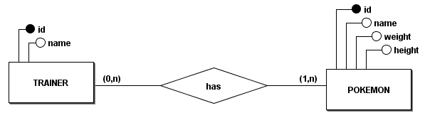
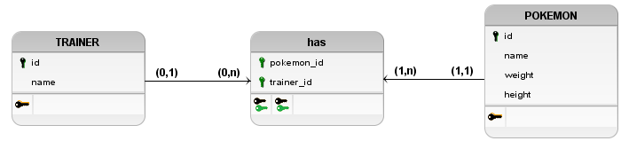

# PokeTeamAPI

This documentation outlines the usage and functionality of the PokeTeamAPI.
Why did I do this? It was just a selection process that required this, and I don't want to delete it

## Overview

The PokeTeamAPI provides endpoints for managing Pokémon teams associated with trainers. Trainers can create teams, retrieve information about their own team, and fetch a list of all teams.

## How To Run
1. Ensure you have docker installed on your machine. If not, you can download it [here](https://www.docker.com/products/docker-desktop).

2. Clone the repository.

    ```bash
    git clone https://github.com/Peedrooo/TriagilPokeTeamAPI.git
    ```

3. Rename the `.env.example` file to `.env`

4. Navigate to the root of the project and run the following command to create network and start the containers.

    ```bash
    docker-network create triagil-network
    docker-compose up poketeam
    ```

5. The API will be available at `http://localhost:5000`.

6. The Swagger documentation will be available at `http://localhost:5000/docs`.


## How To Test

1. Navigate to the root of the project and run the following command to run the tests.

    ```bash
    docker compose up poketeam-test
    ```

## How To Stop

1. Navigate to the root of the project and run the following command to stop the containers.

    ```bash
    docker-compose down
    ```


## Base URL

The base URL for the Team Service API is `/teams`.

## Endpoints

### 1. Create a Team

- **Endpoint:** `/teams`
- **Method:** POST
- **Description:** Create a new Pokémon team for a trainer.
- **Request Body:**
  ```json
  {
    "user": "ash",
    "team": ["pikachu", "blastoise"]
  }
  ```
- **Response:**
  - Status Code: 201 Created
  - Body:
    ```json
    {
      "message": "Team created successfully",
      "status": "success",
      "data": {
        "owner": "ash",
        "pokemons": [
          {
            "name": "pikachu",
            "weight": 60,
            "height": 4
          },
          {
            "name": "blastoise",
            "weight": 85,
            "height": 16
          }
        ]
      }
    }
    ```

### 2. Get Team by Trainer Name

- **Endpoint:** `/teams/{user}`
- **Method:** GET
- **Description:** Retrieve information about a specific trainer's Pokémon team.
- **Path Parameter:**
  - `user`: The name of the trainer.
- **Response:**
  - Status Code: 200 OK
  - Body:
    ```json
    {
      "owner": "ash",
      "pokemons": [
        {
          "name": "pikachu",
          "weight": 60,
          "height": 4
        },
        {
          "name": "blastoise",
          "weight": 85,
          "height": 16
        }
      ]
    }
    ```
  - Status Code: 400 Bad Request
  - Body:
    ```json
    {
      "message": "Trainer ash not found",
      "status": "error",
      "data": null
    }
    ```

### 3. Get All Teams

- **Endpoint:** `/teams`
- **Method:** GET
- **Description:** Retrieve a list of all Pokémon teams.
- **Response:**
  - Status Code: 200 OK
  - Body:
    ```json
    {
      "1": {
        "owner": "ash",
        "pokemons": [
          {
            "name": "pikachu",
            "weight": 60,
            "height": 4
          },
          {
            "name": "blastoise",
            "weight": 85,
            "height": 16
          }
        ]
      },
      "2": {
        "owner": "misty",
        "pokemons": [
          {
            "name": "starmie",
            "weight": 80,
            "height": 11
          },
          {
            "name": "psyduck",
            "weight": 196,
            "height": 8
          }
        ]
      }
      // Additional teams...
    }
    ```

## Database

### Entity Relationship Diagram



### Data Logic Diagram



## Technologies Used

- Python
- FastAPI
- Docker
- Pytest
- brmodelo
